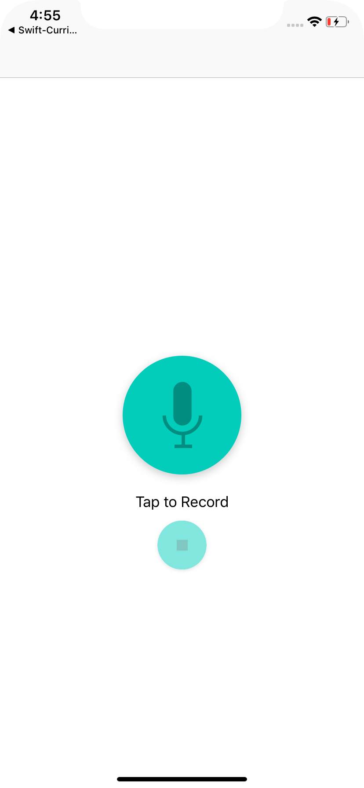
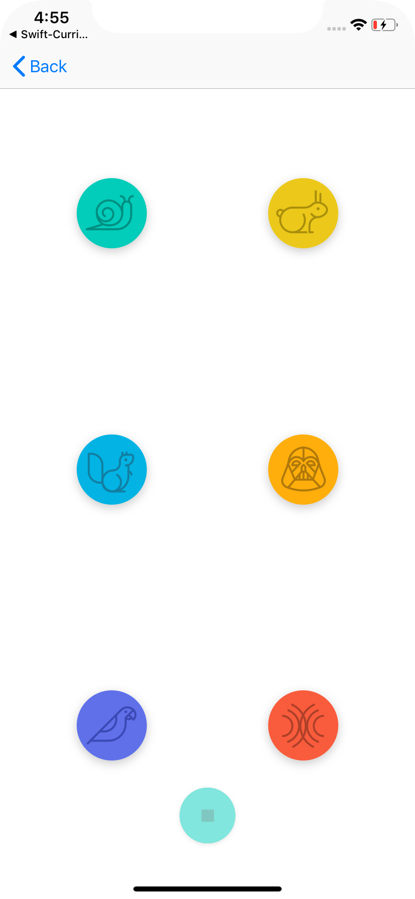
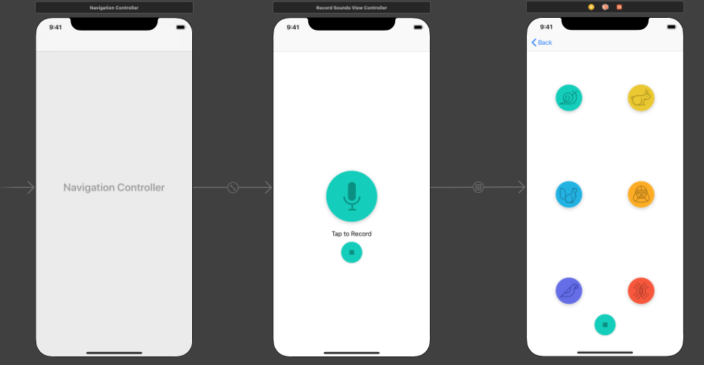

# PitchPerfect (Udacity Nano-Degree Project 1)
iPhone app that will allow users to record their voice and will then modulate the recorded audio to sound like a Chipmunk or Darth Vader. This app will also let the user speed up or slow down the rate of playback, and experience fun echo and reverb effects.

* Leveraged the Model View Controller (MVC) design principles; this includes writing custom model code, and using UIViewController, and UIView
* Create Outlet and Action connections between the views and view controllers. Benefit from the power of Delegates by using them in code
* Navigate between two scenes in the app using UINavigationController
* Play audio files using AVFoundation’s AVAudioEngine class

     

          
     

     

         
     

     

         
     

